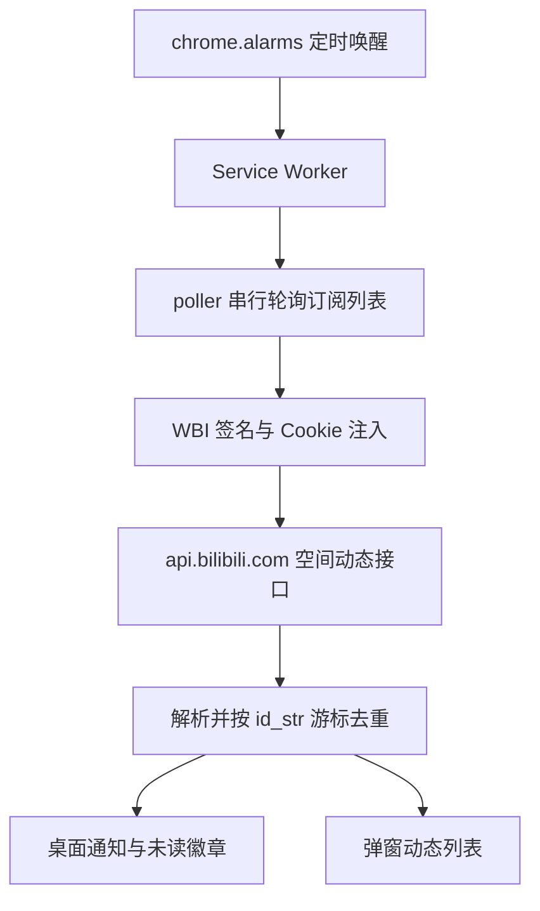

<div align="center">

# B站动态提醒

**订阅 B 站 UP 主的动态更新，有新动态时第一时间弹出桌面通知。**

一个零依赖、零构建的 Chrome / Edge 浏览器扩展（Manifest V3）。

[](LICENSE)
[](https://developer.chrome.com/docs/extensions/mv3/intro/)
[](#)

</div>

---


不用一直盯着 B 站，也不会漏掉关注的人的新动态。

添加想关注的 UP 主 UID 后，扩展会在后台按设定的频率检查他们的空间动态；一旦发现新内容，立刻弹出系统通知，并在扩展图标上显示未读数。点击通知或列表条目，直接跳到对应动态。

## 特性

- **多 UP 主订阅**：按 UID 或空间链接添加，自动回填昵称与头像
- **全类型覆盖**：视频、图文、纯文字、转发、专栏、直播、番剧等全部动态类型都会通知
- **桌面通知与未读徽章**：即便错过了弹窗，也能从图标上看到未读数
- **一键直达**：点击通知或列表条目，新标签页打开动态并自动标记已读
- **频率可调**：1 / 3 / 5 / 10 / 30 分钟，在及时性与风控风险之间自行取舍
- **复用浏览器登录状态**：直接使用已有的 B 站 Cookie，不需要输入账号密码；未登录时自动降级为匿名模式
- **零依赖零构建**：原生 JS + ES Module，克隆下来就能加载，无 npm、无打包器
- **数据只在本地**：全部存于 `chrome.storage.local`，不向任何第三方服务器发送数据

## 安装

目前未上架 Chrome 应用商店，请以「加载已解压的扩展程序」的方式使用：

```bash
git clone https://github.com/rayuuuu/bili-notifier.git
```

1. 浏览器地址栏访问 `chrome://extensions`（Edge 为 `edge://extensions`）
2. 打开右上角的 **开发者模式**
3. 点击 **加载已解压的扩展程序**，选择刚克隆下来的项目根目录（包含 `manifest.json` 的那一层）
4. 建议把扩展图标固定到工具栏，方便查看未读徽章

> 更新代码后，回到 `chrome://extensions` 点击该扩展卡片上的刷新按钮即可重新加载。

## 使用

1. 右键扩展图标 → **选项**（或在弹窗右上角点齿轮图标）打开设置页
2. 在「订阅的 UP 主」中粘贴 UID（如 `2`）或空间链接（如 `https://space.bilibili.com/2/dynamic`），点击 **添加**
   - 首次添加只建立已读基线，**不会弹出历史动态的通知**
3. 按需调整 **检查频率** 与 **桌面通知** 开关
4. 之后扩展会在后台自动检查；也可以在弹窗里点 **立即检查** 手动触发

弹窗中按时间倒序展示最近动态（最多 50 条），未读条目带高亮边条，支持逐条点击跳转或一键 **全部已读**。


## 工作原理



几个实现上的关键点：

- **WBI 签名**：B 站空间动态接口要求 `w_rid` 与 `wts` 签名，密钥每日更替，扩展自行实现签名并按天缓存密钥。签名需要 MD5，而浏览器的 `crypto.subtle` 不提供 MD5，因此内置了一份纯 JS 实现。
- **请求头注入**：`Cookie`、`Referer`、`Origin` 在 `fetch` 中属于 forbidden headers，无法直接设置，扩展通过 `chrome.cookies` 读取后，用 `declarativeNetRequest` 动态规则写入请求头。
- **新动态判定**：以动态的 `id_str`（单调递增的雪花 ID）与已读游标比较，而非时间戳，置顶与补发都不会误判；置顶项会被过滤掉。
- **友好访问**：请求逐个串行发送并带 800 至 1500 毫秒随机抖动；遇到风控错误（`-352`、`-799`、HTTP 412）自动指数退避，并在设置页显示告警。

## 权限说明

| 权限 | 用途 |
|---|---|
| `storage` | 在本地保存订阅列表、设置与动态缓存 |
| `alarms` | 定时唤醒后台轮询（MV3 中 `setInterval` 不可靠） |
| `notifications` | 弹出桌面通知 |
| `cookies` | 读取 `.bilibili.com` 下已有的登录 Cookie，用于访问仅登录可见的动态 |
| `declarativeNetRequestWithHostAccess` | 为请求注入 `Cookie`、`Referer`、`Origin` 头 |
| `*://*.bilibili.com/*` | 主机权限仅限 B 站域名，不涉及任何其他站点 |

## 隐私

- 扩展**不包含任何统计、上报或远程配置代码**，只与 `api.bilibili.com` 通信。
- 读取的 B 站 Cookie 仅用于构造发往 B 站自身的请求头，不会写入存储，也不会离开你的浏览器。
- 订阅列表、动态缓存与设置全部保存在 `chrome.storage.local`，卸载扩展即随之删除。
- 全部代码开源且无构建产物，可逐行审阅。

## 常见问题

**一直收不到通知？**
先在弹窗点「立即检查」看返回结果，再到设置页确认有没有风控告警条。另外检查系统的通知权限（Windows 在设置 - 系统 - 通知中查看），并确认没有开启专注助手或勿扰模式。

**设置页出现风控告警怎么办？**
说明接口返回了 `-352`、`-799` 或 HTTP 412。扩展已自动指数退避，等告警上的恢复时间过去即可，建议把检查频率调大（如 10 或 30 分钟）。

**必须登录 B 站吗？**
不必。未登录时扩展会自动获取匿名 `buvid3` 访问，公开动态照样能抓到，只是仅登录可见的内容拿不到，设置页会显示「匿名模式」。

**支持 Firefox 吗？**
暂不支持。当前实现依赖 Chromium 的 `declarativeNetRequest` 动态规则行为，未做兼容层。

**会不会导致账号被风控？**
扩展采用逐个串行、随机抖动、最小 1 分钟间隔与指数退避来降低风险，但访问的是非公开接口，无法做出任何保证。请勿自行把间隔改得过短。

## 项目结构

```
manifest.json          MV3 清单
icons/                 扩展图标
lib/
  constants.js         存储 key、默认设置、动态类型映射
  store.js             chrome.storage.local 封装
  md5.js               纯 JS MD5（WBI 签名需要，SubtleCrypto 不支持 MD5）
  wbi.js               WBI 签名与密钥缓存
  header-injector.js   chrome.cookies 与 declarativeNetRequest 注入请求头
  bili-api.js          B 站接口封装与错误归一
  dynamic-parser.js    原始动态转为内部 FeedItem
  ui-utils.js          popup 与 options 共用的 DOM 与时间工具
background/
  service-worker.js    入口：alarms、messages、通知事件
  poller.js            轮询编排、新动态 diff、风控退避
  notifier.js          桌面通知与徽章
popup/                 未读动态列表
options/               订阅管理与设置
```

## 参与贡献

欢迎提交 Issue 与 Pull Request。本地调试方式、代码风格约定与发布前的验证清单见 [CONTRIBUTING.md](CONTRIBUTING.md)。

## 致谢

- [SocialSisterYi/bilibili-API-collect](https://github.com/SocialSisterYi/bilibili-API-collect)：本项目的 WBI 签名与动态接口字段实现均参考自该文档。

## 免责声明

本项目是个人开发的非官方工具，与 bilibili 官方无任何关联，也未获得其授权或认可。所使用的接口为 B 站 Web 站点的非公开接口，随时可能变更或失效。请仅将其用于个人订阅提醒等合理用途，因使用本项目产生的任何后果由使用者自行承担。

## 许可证

[MIT](LICENSE) © rayuuuu
